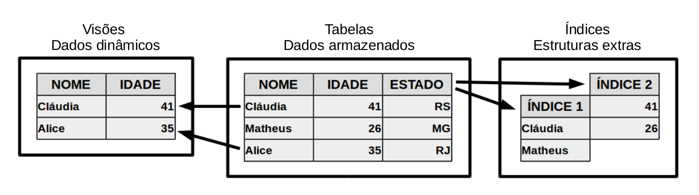
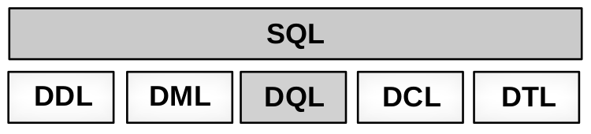
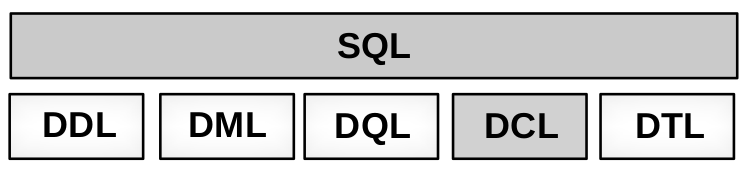

# Introdução ao SQL 

 

----------------------------------------------------------------------

### Objetivos:

1- Aprender SQL  
2- Modelar, normalizar, criar e interagir com banco de dados 

### Requisitos: 

1- Conhecimentos basicos de programação 

### Faz parte do material: 

- Criar e modelar bancos de dados
- Normalizar um banco de dados 
- Interagir com bancos de dados 
- Linguagem SQL ANSI (MySQL)

### Não faz parte do material: 

- Integração com outras linguagem 
- PostgreSQL, Oracle, SQL Server etc

### Instalação: 

- `sudo apt install mysql-server -y`

### Links importantes

- https://www.mysql.com/
- https://dev.mysql.com/doc/ 

- https://www.postgresql.org/
- https://www.postgresql.org/docs/manuals/

- https://www.microsoft.com/en-us/sql-server/sql-server-2019 
- https://docs.microsoft.com/pt-br/sql/sql-server/?redirectedfrom=MSDN&view=sql-server-ver15 

- https://www.oracle.com/index.html 
- https://docs.oracle.com/en/ 

- https://www.firebirdsql.org/
- https://www.firebirdsql.org/en/documentation/ 

---------------------------------------------------------------------- 

 

# 1. Introdução a Bancos de Dados  

O primeiro módulo do curso de SQL oferece uma introdução ao tema de bancos de dados, suas estruturas e alguns termos técnicos utilizados nesta área de TI, além de oferecer uma visão geral sobre os principais bancos de dados disponíveis no mercado. 

---------------------------------------------------------------------- 

 

## Banco de dados:

- Mecanismos de armazenamento de dados 
- Conjunto de informação com estrutura regular (analógico ou digital)
- Bancos de dados não relacionais
	- Arquivos estruturados (não tão avançados)
- Bancos de dados relacionais 
	- Dados organizados em tabelas 
	- Tabelas podem se relacionar com outras tabelas
	- Menor espaço de acesso aos dados
	- Padrão mundialmente utilizado 

**Banco de dados:** Ferramentas que permitem o armazenamento e manipulação de dados   organizados em forma de tabelas.  

**Tabelas:** Forma de organização de dados formada por linhas e colunas.  

**Colunas:** Campos que formam um registro.  

**Linhas:** Registros ou tuplas.  

**Visões:** Consultas SQL a dados das tabelas do banco sem armazená-los.  
 

 
 
## SGBD ou DBMS: 

- **S**istema **G**erenciador de **B**anco de **D**ados 
- **D**ata **B**ase **M**anagement **S**ystem

Não é apenas um banco de dados. Funcionalidade de gerenciar o acesso ao banco de dados. Vantegens para banco de dados multi-usuario. 

- SGBD não é um banco de dados, mas sim um complemento. 
- Não permite que duas ou mais pessoas acessem um registro ao mesmo tempo.
- SGBD é um grupo de programas para interação com os dados. 

**DBA:** Data Base Administrator  

## SQL (Structured Query Language)  

- Linguagem Estruturada de Consulta
- Linguagem declarativa 
- Linguagens: 
	- **DDL** (Data Definition Language): Linguagem de definição de dados 
	- **DML** (Data Manipulation Languege): Linguagem de manipulação de dados
	- **DQL** (Data Query Language): Linguagem de Consulta de dados
	- **DCL** (Data Control Language): Linguagem de controle de dados
	- **DTL** (DataTransaction Language): Linguagem de transação de dados
	

### DDL 

Por meio da DDL é possível definir estruturas. 

- `CREAT`: Cria uma estrutura
- `ALTER`: Altera uma estrutura 
- `DROP`: Exclui um estrutura

### DML 

Responsável pelo gerenciamto dos dados das estruturas criadas com a DDL 

- `INSET`: Insere dados nas dabelas ("observações/registros")
- `UPDATE`: ALtera os dados das tabelas 
- `DELETE`: Exclui dados dadas tabelas 

### DQL 

Complementa a DML e permite recuperação e leitura dos dados 

- `SELECT` Retorna os dados do banco. Pertime ordenação, agrupamento, filtros etc

### DCL 

Permite gerenciar quem pode ou não pode realizar as tarefas das linguagens anteriores. Gerencia os usuários que tem permição de acesso. 

- `GRANT` Habilita acesso a dados e operações
- `REVOKE` Revoga o acesso a dados e operações

### DTL 

Um conjunto de operações que juntas formam uma operação mais complexa. 

- `START TRANSACTION` Inicia transação
- `COMMIT` Concretiza a transação
- `ROLLBACK` Anula a transação 

---------------------------------------------------------------------- 

  

### Principais Bancos de Dados: 

|                   | **MySQL** | **PostgreSQL** | **Firebird** | **Oracle** | **SQL Server** |
|:------------------|:---------:|:--------------:|:------------:|:----------:|:--------------:|
| SGBD              | Sim       | Sim            | Sim          | Sim        | Sim            | 
| ACID              | Sim       | Sim            | Sim          | Sim        | Sim            | 
| Licença Comercial | Não       | Sim            | Sim          | Não        | Não            | 
| Licença Estudante | Sim       | Sim            | Sim          | Express    | Express        | 

---------------------------------------------------------------------- 

 

# 2. Normalização de Dados  

Este módulo aborda os relacionamentos entre tabelas dos bancos de dados relacionais, anomalias de dados e também a normalização de dados, conceito necessário para modelar bancos de dados otimizados e de fácil manutenção. 

---------------------------------------------------------------------- 

  

## Relacionamentos e chaves 

### Relacionamentos 

- Ligações entre as tabelas 
- Tabelas compostas por linhas e colunas. Algumas colunas são utilizadas para que se crie relacionamentos entre as tabelas (chaves) 

### Chave Primária (Primary Key, PK) 

- Coluna com valores únicos 

### Chave composta 

- Compisoção de duas ou mais colunas para gerar uma combinação única. 

### Chave Estrangeira (Foreign Key, FK) 

- Coluna que armazena a chave primária de outra tabela 

### Tipos de relacionamentos 

- Relacionamento 1 para 1 ( 1 : 1 ) 
	- Para cada registro da primeira tabela existe no máximo um correspondente na segunda tabela, e vice-versa.

- Relacionamento 1 para muitos ( 1 : * ) 
	- Para cada registro da primeira tabela pode existir um ou mais correspondentes na segunda tabela, e para cada registro na segunda tabela existe apenas um registro correspondente na primeira tabela. 

- Relacionamento muitos para muitos ( * : * )
	- Para cada registro da primeira tabela pode existir um ou mais correspondentes na segunda tabela, e vice-versa.

**Boas práticas no uso de chaves:** Quanto menor, melhor! Chaves com códigos internos

### Diagrama de modelo de dados 

- Um dos padrões de modelagem de dados 
- Relacionamento ( 1 : 1 ) ||------|| 
- Relacionamento ( 1 : * ) ||------|< 
- Relacionamento ( * : * ) >|------|< 

### Anomalias dos dados 

- Tabelas "fazem tudo" geram anomalias 
- Anomalia de inserção 
	- Impede a inclusão de registros devdo à falta de dados 
- Anomalia de exclusão 
	- Impede a exclusão de registros devido ao relacionamento com outra tabela 
- Anomalia de alteração 
	- Impede a alteração de registros devido ao relacionamento com outra tabela (solução chave interna)

### Normalização de dados 

- Evita anomalias 
- Facilita a manutenção
- Maximiza a perfurmance 
- Manter a integridade dos dados 
- Normalização de dados 
	- Criada em 1970
	- 5 formas normais (FN's)
	- Ná prática a normalização é feita por intuição
	- Resulta em um número maior de tabelas no banco
	- Mais tabelas podem aumentar a manutenção e diminuir a performance 
	- Deve ser utilizado com bom senso 

#### Primeira Forma Normal (1FN) 

- Cada linha de tabela deve representar um registro
- Cada célula de tabela deve conter um punico valor 

#### Segunda Forma Normal (2FN) (colocar exemplos)

- Obrigatóriamente estar na 1FN 
- Atributos não chave da tabela devem depender de alguma das chaves da tabela

#### Terceira Forma Normal (3FN) 

- Obrigatóriamente na 3FN 
- Atributos não chave da tabela depender exclusivamente da chave primária da tabela. 

#### 4FN e 5FN 

- Separam em novas tabelas valores que ainda estejam redundantes em uma mesma coluna. 

---------------------------------------------------------------------- 

 

# 3. Criando um Banco de Dados  

Neste módulo serão abordados os principais tipos de dados existentes nos bancos de dados, os atributos que os tipos de dados podem ou não possuir e os comandos de criação e gerenciamento de estruturas no banco de dados.

---------------------------------------------------------------------- 

  

##  SQL ANSI, ISO e outros 

- SQL (Structured Query Language) 
	- Linguagem declarativa, detalha a forma do resultado
	- Criado no início dos anos 70, em laboratórios da IBM 
	- Novos dialetos surgiram, derivando e evoluindo o SQL 

- Necessidade de padronização 
	- Americam Ntional Standards Institute (ANSI) em 1986
	- International Organization for tandardization (ISO) em 1987
	- Revisto pela primeira vez em 1992 originando o SQL-92 
		- SQL:1999 Incorporou características de expressões regulares, queries recursivas e triggers
		- SQL:2003 incorporou características de XML, sequências 

		- SQL:2008, SQL:2011 etc

	- Bancos de dados criam e evoluem suas próprias derivações do SQL

## Tipos de dados (pegar tabela)

- Boleanos e Númericos	
	- BOOLEAN
	- FLOAT
	- NUMERIC
- String
	- CHAR
	- VARCHAR
- Data e Hora
	- DATE
	- TIME
	- DATETIME
	- TIMESTAMP
- Listas customizadas 
	- ENUM

### Outros tipos de dados 
	
- **BLOB:** permite o armazenamento de informações binárias, arquivos e imagens
- **TEXT:** permite o armazenamento de grandes informações de strings
- **REDES:** permite o armazenamento de entereçoes IP, MAC-ADDRESS e outros
- **Monetários:** permite armazenamento de valores menetários com formatação 
- **Geométricos:** permite o armazenamento de infomações de formas geométricas

## Atributos 

- **NULL/Not NULL**

Permite ou não valores nulos ou não. Pode criar uma regra para exigir o preenchimento de uma campo. 

- **Unsigned/Signed**

Permite ou não números negativos (valores numéricos)
	
- **Auto-increment** (valores numéricos)

Sequências, contadores. Incrementa um campo automaticamente (ID por exemplo: 1,2,3,...)

- **Zerofill** 

Preenche  valor numérico completando com zeros a esquerda 

**Boas práticas de armazenamento:** 

1) Espaço em disco: Quanto menor o tipo de dado, menos espaço ele ocupará
2) Processamento e busca: Quanto menor o tipo de dado, mais rápido é o processamento 

		Qual o menor e maior valor que o campo poderá receber?

-------------------------------------------------------------------------

## DDL (Data Definition Language)

Por meio da DDL é possível definir estruturas. 

- `CREAT`: Cria uma estrutura
- `ALTER`: Altera uma estrutura 
- `DROP`: Exclui um estrutura

### Como funciona  (colocar imagem) 

- `CREATE DATABASE Nome` 

	Nomes sem espeços e sem caracteres especiais (UTF-8) 

- `ALTER DATABASE Nome Propriedade`

- `DROP DATABASE Nome` 

	Exclusão é irreversível 

(Hierarquia nas tabelas (imagem))

- `CREATE TABLE Nome (Campos)` 

	Sintaxe de descrição de campo:
		Nome TipoDeDado Atributos 
	Atributos 
		Null, Zerofill, Unsigned, Auto-increment, Chave 

- `ALTER TABLE Nome Propriedade` 

- `DROP TABLE Nome` 

	Exclusão é irreversível 

### O que são índices 

Estruturas independente criadas para processar o ordenamento dos registros e armazenam o ordenamento para que não seja necessário ordenar em toda consulta. Apenas o campo é armazenado no índice. 

- `CREATE INDEX Nome ON TabelaEColuna` 

- `ALTER IDEX Nome Propriedade` 

- `DROP INDEX Nome` (remove só o índice e não os dados da tabela) 

### O que são sequências 

Um número que será incrementado sempre que "criado" 

- `CREATE SEQUENCE Nome` 

- `ALTER SEQUENCE Nome Propriedade` 

- `DROP SEQUENCE` 

---------------------------------------------------------------------- 

 

# 4. Manipulando Dados

Os comandos de gerenciamento de dados são abordados neste módulo, abordando como inserir, alterar, excluir e retornar dados do banco.

---------------------------------------------------------------------- 

  

## DML (Linguage de Manipulação dos Dados)

- `INSERT` Insere dados 
- `UDATE` ALtera dados 
- `DELETE` Exclui dados 

## DQL (Linguagem de Consulta de Dados)

- `SELECT` Retorna uma seleção dos dados 
- Ordenação de dados 
- Agrupamento de dados
- Filtros de seleção 
- Funções aritmétias 

### Gerenciando dados 

- `INSERT INTO tabela VALUES (valores)` 
- `SELECT campos FROM tabela` 
- `UPDATE tabela SET = valor` Altera o calor de todos os registros da tabela 
- `DELET FROM tabela` Deleta toda a tabela 

### Filtros de seleção 

- Registros selecionados (`WHERE`) 
- Operadores relacionais 
	- Igual (`=`), Diferente (`!=`) 
	- Maior (`>`), Maior ou igual (`<=`)
	- Menor (`<`), Menor ou igual (`<=`)
	- Nulo (`IS NULL`), ou não-nulo (`IS NOT NULL`)
	- Entre intervalo (`BETWEEN`)
	- Valor parcial (`LIKE`) (pedaço de string

- Operadores lógicos 
	- `AND` duas ou mais condições devem ser atendidas
	- `OR` 
	- `NOT` 

#### Consultando dados com filtros: 

- `SELECT campos FROM tabela WHERE condição` 
- `UPDATE tabela SET campo = valor WHERE condição`
- `DELETE FROM tabela HERE condição`

#### Atributos especiais 

- Apelido de tabela 
	- `SELECT campos FROM tabela apelido` 

- Apelido de campos (`AS`)
	- `SELECT campo AS apelido FROM`

- Unindo seleções (`UNION (ALL)`)
	- `SELECT ...UNION SELECT...`

---------------------------------------------------------------------- 

 

# 5. Relacionamentos e Visões

Este módulo aborda de maneira mais aprofundada os relacionamentos entre as tabelas do banco de dados, explicando os diferentes tipos de relacionamentos e os diferentes tipos de JOINS possíveis de serem feitos entre as tabelas. A criação de visões para armazenar expressões SELECT de relacionamentos ou não também é abordada neste módulo.

---------------------------------------------------------------------- 

  

## Relacionamentos no SQL 

- Infomações relacionadas entre si mas armazenadas em tabelas diferentes ou na mesma tabela 

- Em geral entre diferentes tabelas 

- Geralmente possuem campos em comum 

- Parâmetro `JOIN` e suas variações 

- `SELECT ... FROM T1 JOIN T2 ON T1.FK = T2.PK`

- `SELECT ... FROM T1 JOIN T2 USING chave` A coluna a chave aparece uma única vez 

- Compatibilidade com bancos de dados 

### Inner join 

- Join padrão 
- Produto cartesiano entre as tabelas 
- Combina todas as linhas da primeira tabela com todas as linhas da segunda, que satisfaçãm as condições das chaves 

`SELECT * FROM pessoas JOIN veiculos ON pessoas.cpf = veiculos.cpf` 

(Tabelas nos slides) 

### Equi join 

- Similar ao Inner join 
- Chaves de mesmo nome entre as tabelas 

`SELECT * FROM pessoas JOIN veiculos USING (cpf)` (o campo em comum não aparece duas vezes)

- Relacionamento sem um campo em comum (Non equi join)

`SELECT p.nome, p.salarios, s.faixa FROM pessoas p INNER JOIN salarios ON p.salario BETWEEN s.inicio AND S.fim` 

### Outer join, Left join, Left outer join  

- Linhas quan não satisfazem a condição de união 
- Left: Linhas da primeira tabela cujo campo de condição não satisfaçam a união de tabelas 

`SELECT * FROM pessoas LEFT JOIN veiculos ON pessoas.cpf = veiculos.cpf` 

### Right join, Right outer join 

- Similar ai Left join 
- Right: Linhas da segunda tabela cujo campo de condição não satisfaçãm a união de tabelas 

`SELECT * FROM pessoas RIGHT JOIN veiculos ON pessoas.cpf = veiculos.cpf` 

### Full outer join 

- Combinalçao de Left join e Righr join 
- Linhas da primeira e segunda tabela culos campos de condição não satisfaçam a união de tabelas 

### Self join (relcionamento de uma tabela com ela mesma) 

- União da tabela com ela mesma 

`SELECT A.nome, B.nome AS indicado_por FROM pessoas A JOIN pessad B on A.indicado = B.CPF` 

## Visões 

- Relação que não faz parte do modelo lógico 
- Não armazenam dados 
- Expressão `SELECT` pré-programada 
- Acessível ao usuário como uma relação virtual 
- Otimização de espaço em disco
- Centralização de código 
- Facilidade de manutenção de expressções SQL 

### Criando uma visão 

- `CREATE VIEW nome AS expressãoSQL` 

- `ALTER VIEW nome propriedade` Exclusão e nova criação (substituição) 

- `DROP VIEW nome` Apenas a estrutura da visão é removida. Os ddos permanecem intactos em suas respectivas tabelas 

---------------------------------------------------------------------- 

 

# 6. Funções Especiais e Subqueries

Neste módulo são vistas diversas funções especiais de seleção e processamento de dados que o SQL oferece para facilitar a busca por informações no banco.

---------------------------------------------------------------------- 

  

## Funções de agregação 

- `COUNT` Contagem de registros de uma consulta 

`SELECT COUNT(*) FROM funcionarios` contagem de funcionários.

- `SUM` Soma de um determinado campo da expressão sql (soma de salários por exemplo) 

`SELECT SUM(salario) FROM funcionarios` soma dos salarios.

- `AVG` Calcula amédia de um campo para registros especificados 

`SELECT AVG(salario) FROM funcionarios` média dos salarios.

- `MAX` Valor máximo de uma consulta sql

`SELECT MAX(salario) FROM funcionarios` o maior salario dos funcionarios

- `MIN` Valor mínimo retornado pela consulta 

`SELECT MIN(salario) FROM funcionarios` o menor salario dos funcionarios

## Integrando com WHERE 

- `SELECT comando FRM tabela WHERE condição` 

`SELECT SUM(salario) FROM funcionarios WHERE departamento = 'Recursos Humanos'`

## Funções de paginação 

- Funções de paginação ("resultado mostrado aos poucos")
	- `DISTINCT` Seleciona os valores únicos, sem repetição 

`SELECT DISTINCT(departamento) FROM funcionarios`

	- `ORDER BY` Ordena o resultado baseado nas colunas informadas (ASC, DESC) 

`SELECT * FROM funcionarios ORDER BY salario` 

	- `LIMIT` Limita o número de resultados

`SELECT * FROM funcionarios LIMIT 2`
 
	- `OFFSET` Indica quantos registros devem ser avançados 

`SELECt * FROM funcionarios OFFSET 2` 

## Funções de agrupamento 

- Funções de agrupamento categoriza e filtra categorias de registros 
	- `GROUP BY` Agrupamento de registros por categoria para operações

`SELECT departamento, AVG(salario) FROM funcionarios GROUP BY departamento`

	- `HAVIN` Seleção de agrupamento 

`SELECT departamento, AVG(salario) FROM funcionarios GROUP BY departamento HAVING AVG(salario) > 1500`

## Subqueries (Subconsultas)

- Realização de consultas dom filtro de seleção baseado em uma lista ou outra seleção 
- `IN` / `NOT IN`

`SELECT nome from Funcionarios WHERE departamento IN ('Marketing' ,'TI')` 

`SELECT nome from Funcionarios WHERE departamento IN (SELECT departamento FROM funcionarios GROUP BY departamento HAVING AVG(salario) > 1500` 

---------------------------------------------------------------------- 

 

# 7.  Controle de Acesso

O gerenciamento de acesso das informações existentes nos bancos de dados é abordado neste módulo, explicando as camadas de controle de acessos que existem nos principais bancos de dados.

---------------------------------------------------------------------- 

 

## DCL - Controle de acesso 

- Forma de garantir que somente pessoas autorizadas possam realizar ações com os dados 
- Níveis de acesso 
	- Banco de dados 
	- Tabelas 
	- Colunas 
	- Registros 
- Níveis de ações 
	- Gerenciar estruturas 
	- Gerenciar dados 
	- Ler dados 

### Como funciona 

1. Possou acesso ao servidor?
2. Possui acesso ao banco?
3. Possui acesso a tabela?
4. Possui acesso a coluna? 
5. Possui aceço ao registro? 
6. Possui acesso a operação? 

### Data Control Language 

- `CREATE USER nome` cria um usuário
- `DROP USER nome` Exclui um usuário 
- `GRANT` abilita acessos 
- `REVOKE` REvoga acessos 

### Gerenciando acessos 

- Habilitando acesso 

`GRANT ação ON estrutura TO usuário` 

- Revogando acesso 

`REVOKE ação ON estrutura FROM usuário` 

- Ações: `ALL`, `SELECT`, `UPDATE`, `DELETE`

- Estruturas: `TABLE`, `VIEW`, `SEQUENCE` 

---------------------------------------------------------------------- 

 

# 8. Transações (ACID)

O assunto transações e as propriedades ACID são abordadas neste módulo.

---------------------------------------------------------------------- 

  

## Transações 

- Conjunto de operações (ACID)
	- Atomicidade: A transação só ocorre por inteiro 
	- Consistência: As regras não podem ser quebradas
	- Isolamento: dados travados durante a transação. Outro processo não tem acesso
	- Durabilidade: Transações confirmadas e disponíveis 

**Exemplo:** 

- Transferência bancária de cliente **A** para **B** 
	- Verifica se há saldo suficiente na conta do cliente **A** 
	- Retira da conta do cliente **A** o valor da transferência 
	- Deposita na conta do cliente **B** o valor da transferência 
(imagem)

## DTL (Data Transaction Language) 

Linguagem de transação de dados

- `START TRANSACTION` Inicia a transação
- `COMMIT` Concretiza a transação 
- `ROLLBACK` Anula a transação 

---------------------------------------------------------------------- 

 

# 9. Stored Procedures e Triggers

Neste módulo serão apresentados os recursos de Stored Procedures e Triggers existentes nos principais bancos de dados.

---------------------------------------------------------------------- 

  

- Blocos de código SQL armazenados no banco (procedimentos armazenados) 
- Vantagens 
	- **Centralização:**  o código e o procedimento 
	- **Segurança:** Diferentes pessoas intragindo com o banco 
	- **Performance/velocidade** 
	- **Suporte a transações**
- Desvantagens
	- A centralização pode deixar lento. 

(exemplo)

## Gerenciando Stored Procedures 

- Criando uma Stored Procedure: 
	- `CREATE PROCEDURE nome`

- Invocando uma Stored Procedure
	- `CALL nome EXECUTE nome` 

- Excluindo uma Stored Procedure: 
	- `DROP PROCEDURE nome` 

## Triggers (Gatilhos) 

- Eventos que disparam a execução de códigos SQL sem a necessidade de uma chamada por um usuário. (horarios ou intervalos de repetição) 

- Vantagens
	- As mesmas das Stored Procedures 
	- Execução de código SQL baseado em eventos. 

- Tipos 
	- `BEFORE INSERT`: Executa um código **ANTES** que um registro seja inserido em uma determinada tabela. 
	- `BEFORE UPDATE`: Executa um código **ANTES** que um registro seja atualizado em uma determinada tabela. 
	- `BEFORE DELETE`: Executa um código **ANTES** que um registro seja deletado de uma determinada tabela. 
	
	- `AFTER INSERT`: Executa um código **DEPOIS** que um registro seja inserido em uma determinada tabela. 
	- `AFTER UPDATE`: Executa um código **DEPOIS** que um registro seja atualizado em uma determinada tabela. 
	- `AFTER DELETE`: Executa um código **DEPOIS** que um registro seja deletado de uma determinada tabela. 

	- Triggers temporais 

## Gerenciando Triggers 

- Criando um trigger: 
	- `CREATE TRIGGER nome tipo ON tabela`

- Excluindo um Trigger 
	- `DROP TRIGGER nome` 

